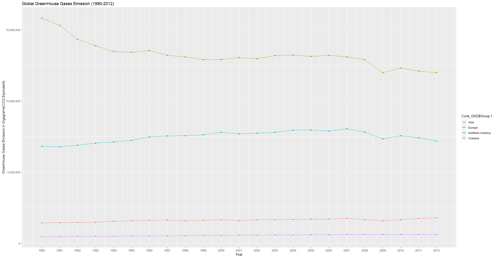
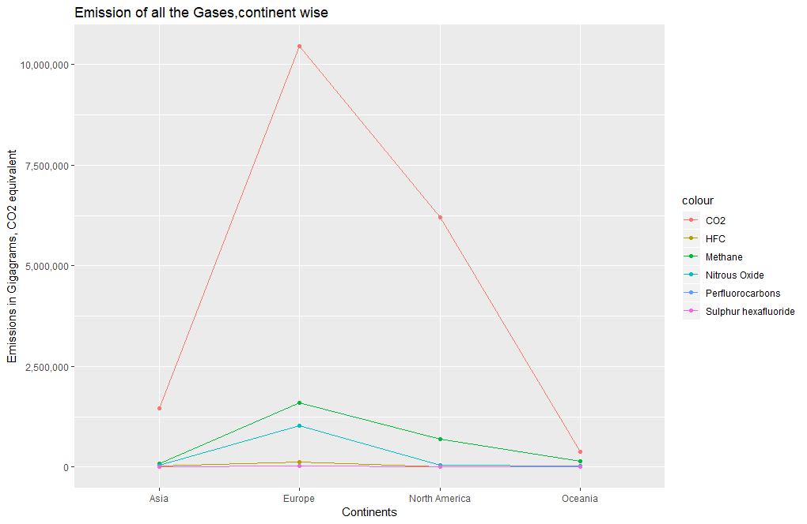
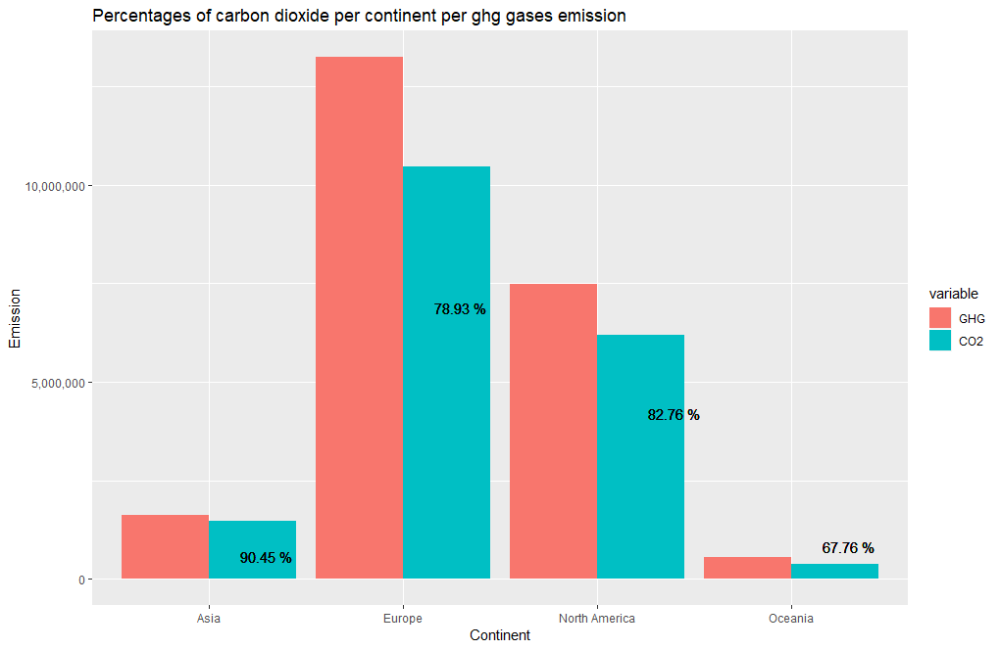
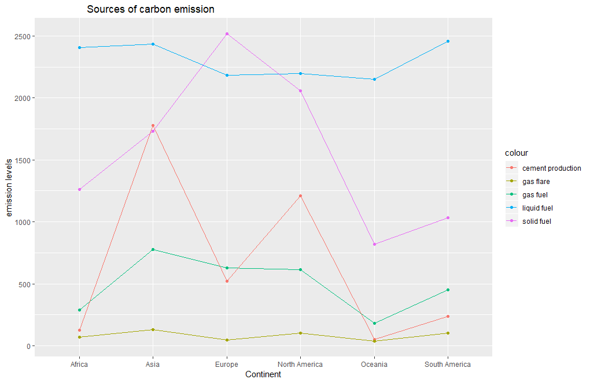
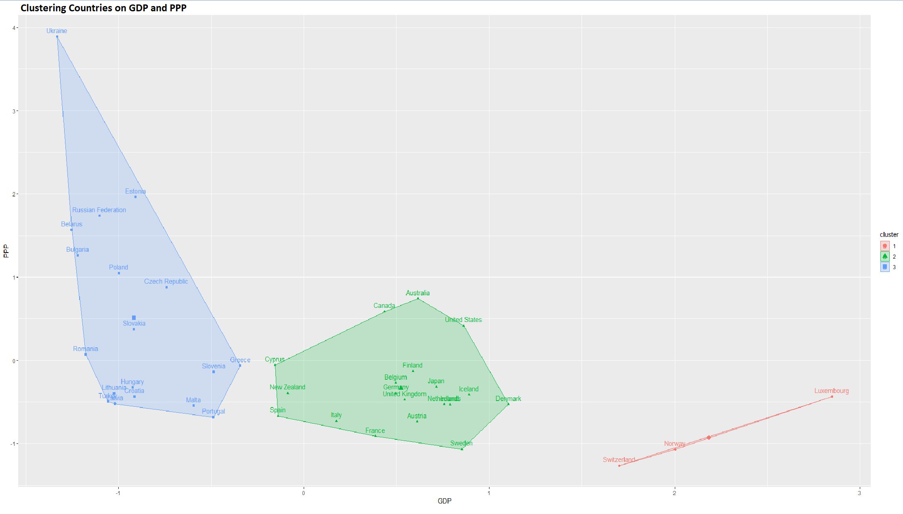
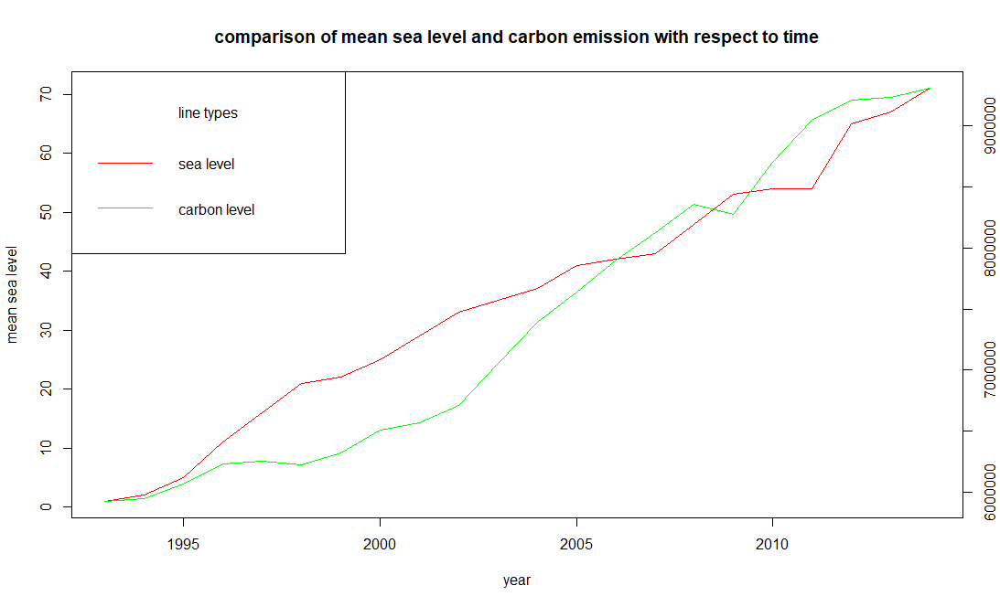
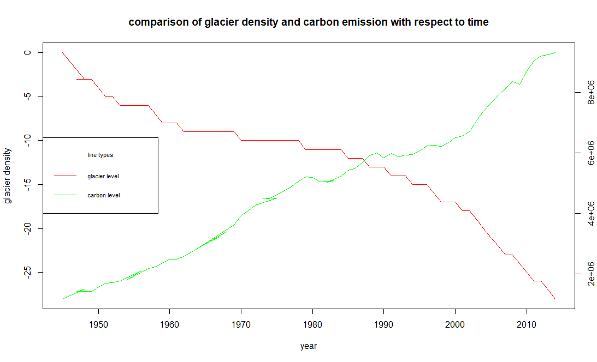
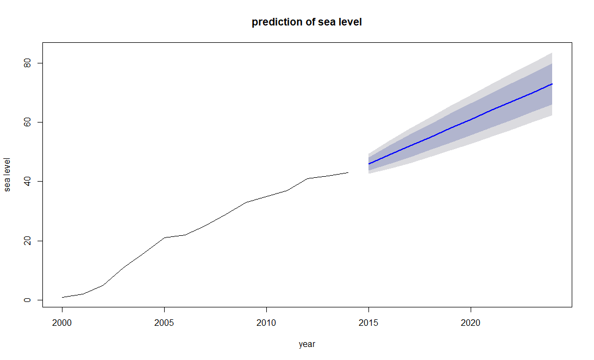
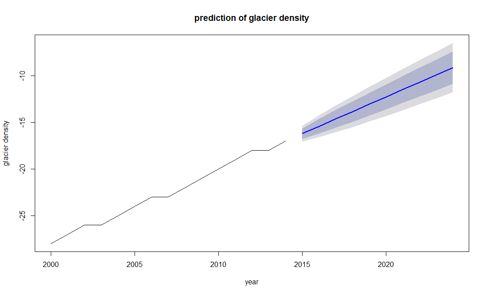

# Climate Change Analysis
Climate change is one of the major concerns nowadays and there are various factors which are influencing it, and one of the major factor which is causing climate change is Air degradation due to emissions from different sources. We can already witness the effects of this through temperature rise due to global warming , rise in sea level and climate change. As serious as this issue of environmental degradation is, it is also just as fascinating to analyze how it also impacts social and economic sustainability. We have utilized climate change related datasets obtained from various sources that provide information about greenhouse gases emissions, carbon dioxide emissions per $1 GDP (PPP, Purchasing Power Parity), sea level data and glacier density recordings over the period.  For the analysis, we cleaned and handled the missing data using packages such as tidyr and dplyr. Then analyzed and visualized the data by plotting them to find out the trends and insights from the plots. We plotted co2 emission with respect to other gases, continent wise, increase in sea level  and decrease in glacier density with increase in carbon levels over period of time, we did clustering based on GDP using K means and used timeseries to forecast sea level and density of ice caps over a period of 10 years. With information rich datasets, increasing phenomena of climate change in different parts of the world and the rising importance of taking preventive measures to curb the harm our man-made inventions are causing we have chosen this problem as our center for data mining and come up with interesting insights through various graphs and plots. 

### Install

This project requires **R and RStudio** and the following libraries installed:

- [dplyr] (https://www.rdocumentation.org/packages/dplyr/versions/0.7.8)
- [tidyr] (https://www.rdocumentation.org/packages/tidyr/versions/0.8.3)
- [ggplot2] (https://ggplot2.tidyverse.org/)
- [kmeans] (https://www.rdocumentation.org/packages/stats/versions/3.6.1/topics/kmeans)
- [forecast] (https://www.rdocumentation.org/packages/forecast/versions/8.9/topics/forecast)

Make sure you have [R](https://www.r-project.org/) installed.

Also install [RStudio](https://rstudio.com/) which is an IDE for R. 

### Run

In a terminal or command window, run the following window to run the R file

```bash
r -f <filename.r>
```  
or you can open the file in RStudio and run it from the software or run the above command in RStudio terminal.

## Results 
Greenhouse Gas Emission across continents between 1990-2012:



Component wise Greenhouse Gas Emission:



Composition of Carbon Dioxide in Greenhouse Gas Emission (%)



Sources of carbon dioxide emission



Clustering of the Countries with least to maximum carbon emission to maximum carbon emission based on GDP



Trend Analysis of Carbon Dioxide emission and Sea level rising



Trend Analysis of Carbon Dioxide emission and Glacier density decreasing



Prediction of increase in Sea Level and decrease in Glacier Density over next 10 years	





## Contributing
Pull requests are welcome. For major changes, please open an issue first to discuss what you would like to change.

Please make sure to update tests as appropriate.